# C++11语言新特性

## Variadic Templates（数量不定的模板参数）

...就是一个所谓的pack（包）

用于function parameters，就是function parameters pack（函数参数包）

用于template parameters，就是template parameters pack（模板参数包）

用于function parameter types，就是function parameter types pack（函数参数类型包）

```C++
void print()
{}

template <typename...Types>
void print(const Types&...args)
{
    std::cout << "全泛化" << std::endl;
    std::cout << "size: " << sizeof...(args) << std::endl;
    print(args...);    // call print() for remaining arguments
}

template <typename T, typename...Types>
void print(const T& firstArg, const Types&...args)
{
    std::cout << "偏特化" << std::endl;
    std::cout << "size: " << sizeof...(args) << std::endl;
    std::cout << firstArg << std::endl; // print() first argument
    print(args...);    // call print() for remaining arguments
}
```

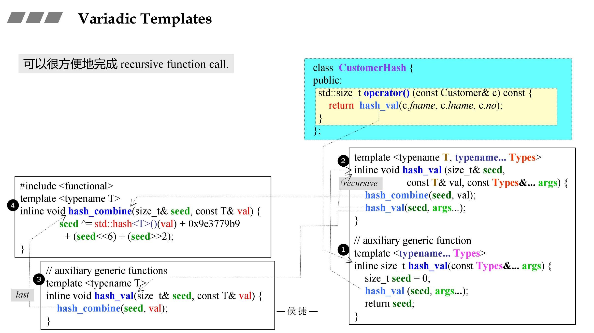
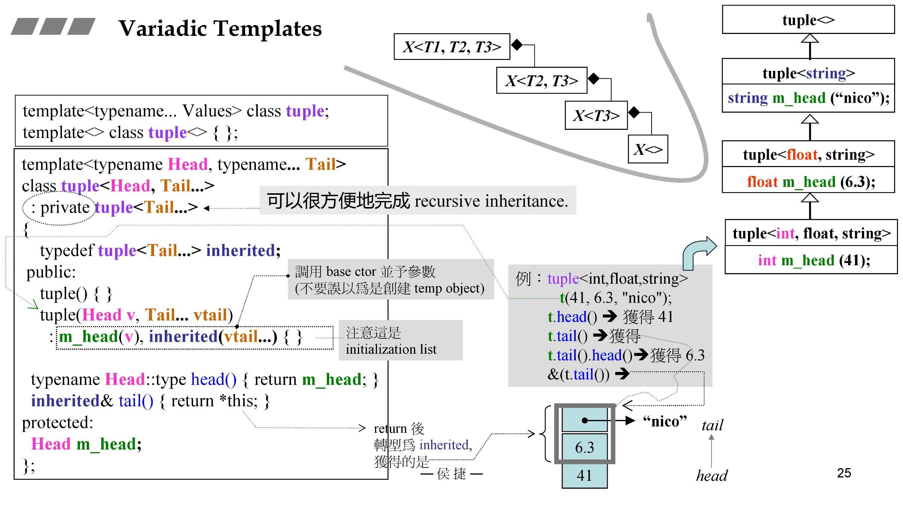

## Spaces in Template Expressions

```C++
std::vector<std::list<int> >;   // OK in each C++ version
std::vector<std::list<int>>;    // OK since C++ 11
```

## nullptr and std::nullpptr_t

C++ 11 lets you use nullptr instead of 0 or NULL to specify that a pointer refers to no value (which differs from havng an undefined value). This new feature especially helps to avoid mistakes that occured when a null pointer was interpreted as an integral value.

nullptr is a new keyword. It automatically converts into each pointer type but not to any integral type. It has type std::nullptr_t, defined in \<stddef\>.

```C++
void f(int);
void f(void*);
f(0);       // calls f(int)
f(NULL);    // calls f(int) if NULL is 0, ambiguous otherwise
f(nullptr); // calls f(void*)
```

## Automatic Type Deduction with **auto**

With C++ 11, you can declare a variable or an object without specifying its specific type by using **auto**.

Using auto is especially useful where the type is a pretty long and/or complicated expression.

## Uniform Initialization

C++ 11 introduced the concept of **uniform initialization**, which means that for any initializaton, you can use one common syntax, the syntax uses braces.

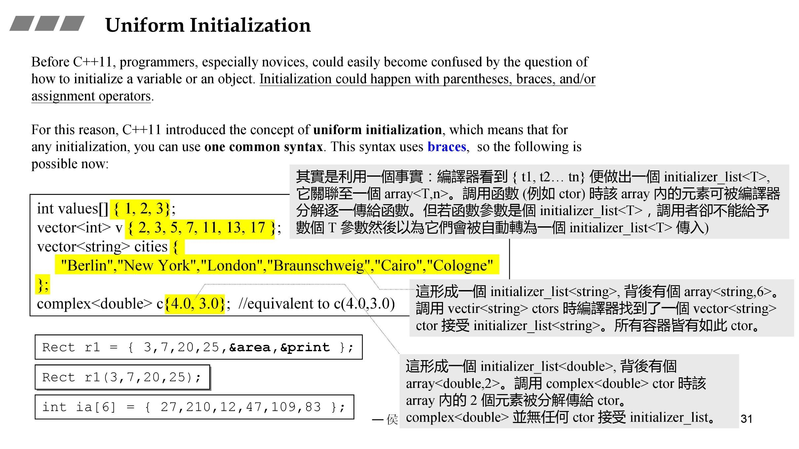

## Initializer Lists

An initializer list forces so-called value initialization, which means that even local variables of fundamental data types, which usually have an undefined initial value, are initialized by zero (or nullptr, if it is a pointer):

```C++
int i;      // i has undefined value
int j {};   // j is initialized by 0
int* p;     // p has undefined value
int* q {};  // q is initialized by nullptr
```

Note, however, that narrowing initializations--those that reduce precision or where the supplied value gets modified--are not possible with braces.

```C++
int x1(5.3);                        // OK, x1 becomes 5
int x2 = 5.3;                       // OK, x2 becomes 5
int x3 {5.0};                       // ERROR, narrowing
int x4 = {5.3};                     // ERROR, narrowing
char c1(7);                         // OK, even though 7 is an int, this is not narrowing
char c2 {99999};                    // ERROR, narrowing
std::vector<int> v1 {1,2,3,4,5};    // OK
std::vector<int> v2 {1,2,3,4,5.0};  // ERROR, narrowing
```

To support the concept of initializer lists for user-defined types, C++ 11 provides the class template **std::initializer_list<>**. It can be used to support initializations by a list of values or in any other place where you want to process just a list of values.

```C++
void print(std::initializer_list<int> vals)
{
    for (auto p = vals.begin(); p != vals.end(); p++)
    {
        std::cout << *p << std::endl;
    }
}

print({ 1,2,3,4,5,6 });
```

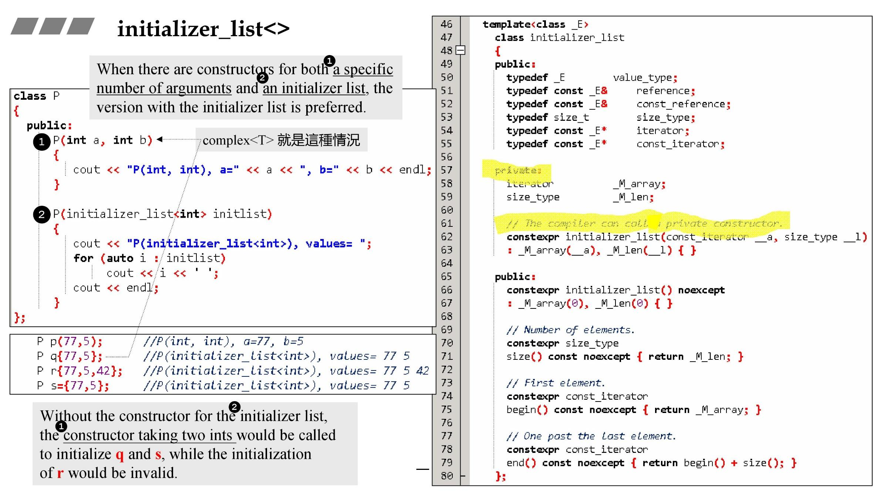
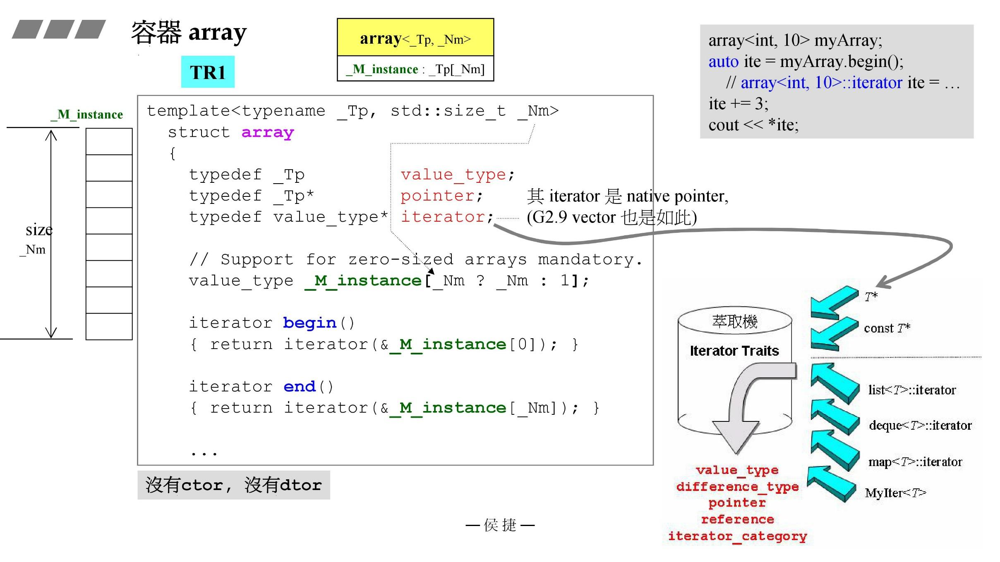

## **explicit** for ctors taking more than one argument

禁止隐式调用构造函数

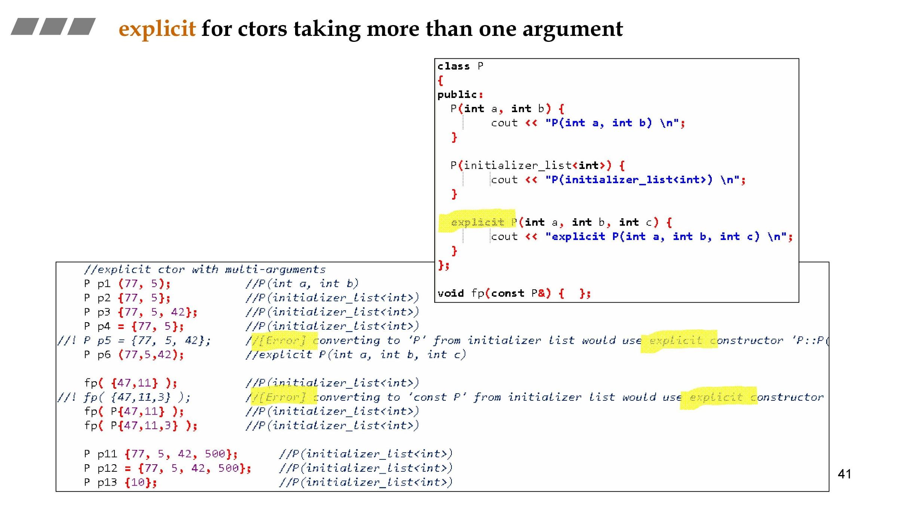
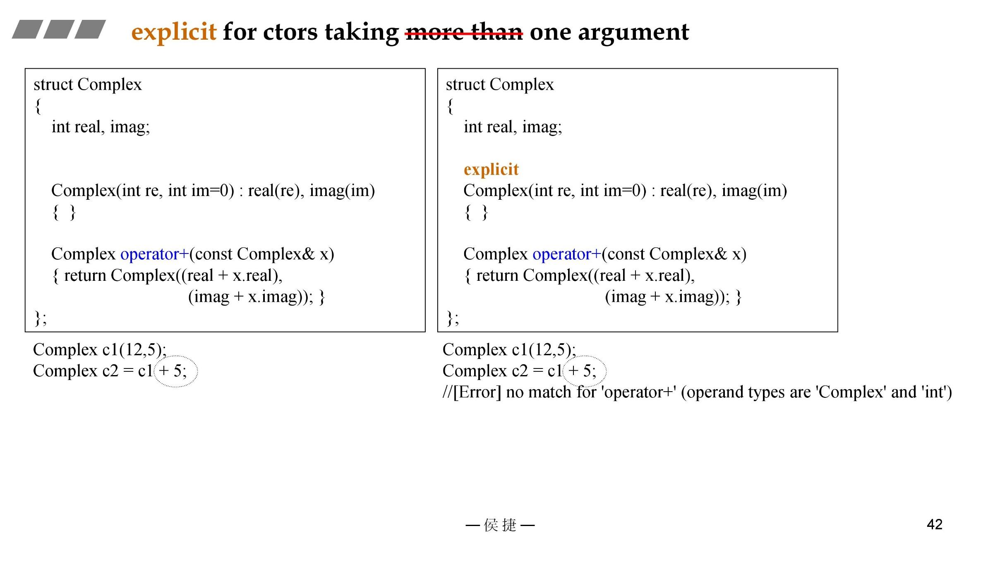

## range-based **for** statement

no explicit type conversions are possible when elements are initialized as *decl* inside the for loop.

```C++
class C
{
    public:
        explicit C(const std::string& s);   // explicit(!) type conversion from strings
    ...
}

std::vector<std::string> vs;
for(const C& elem : vs) // ERROR, no conversion from string to C defined
{
    std::cout << elem << std::endl;
}
```

## =default, =delete

如果你自行定义了一个ctor，那么编译器就不会再给你一个default ctor。

如果你强制加上=default，就可以重新获得并使用default ctor。

## Alias Template(template typedef)

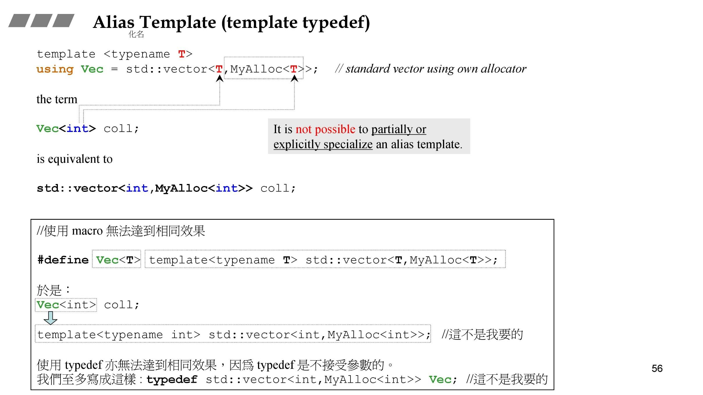

## template template parameter

思考其应用场景~

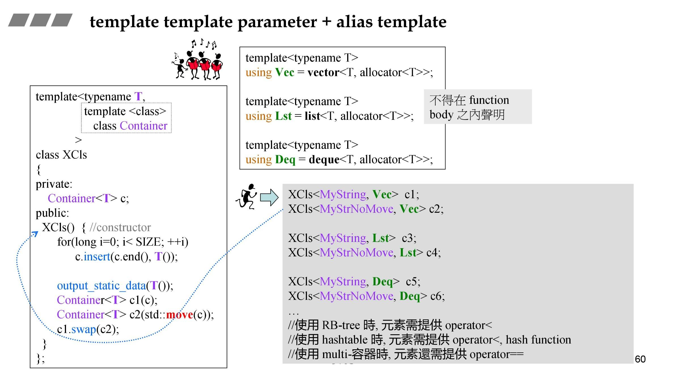

## Type Alias(similar to typedef)

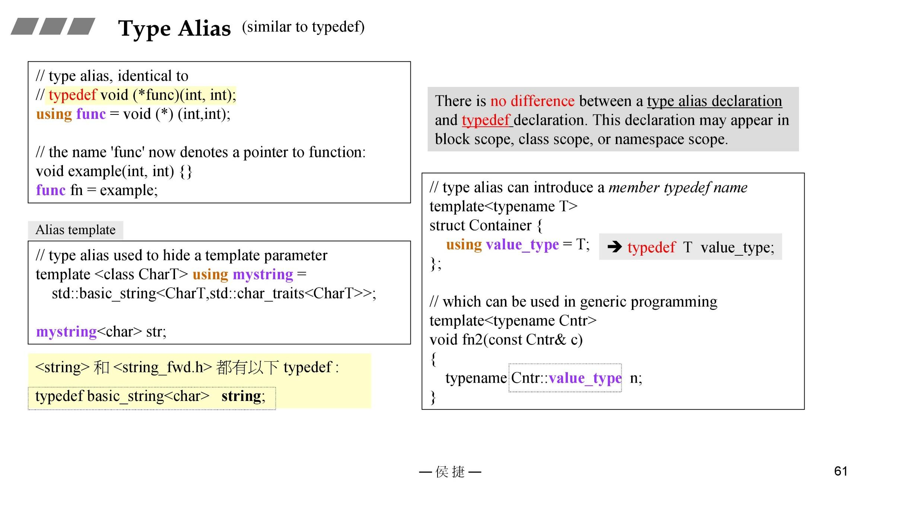

## noexcept

类采用移动赋值时一定要有noexcept，避免抛出异常

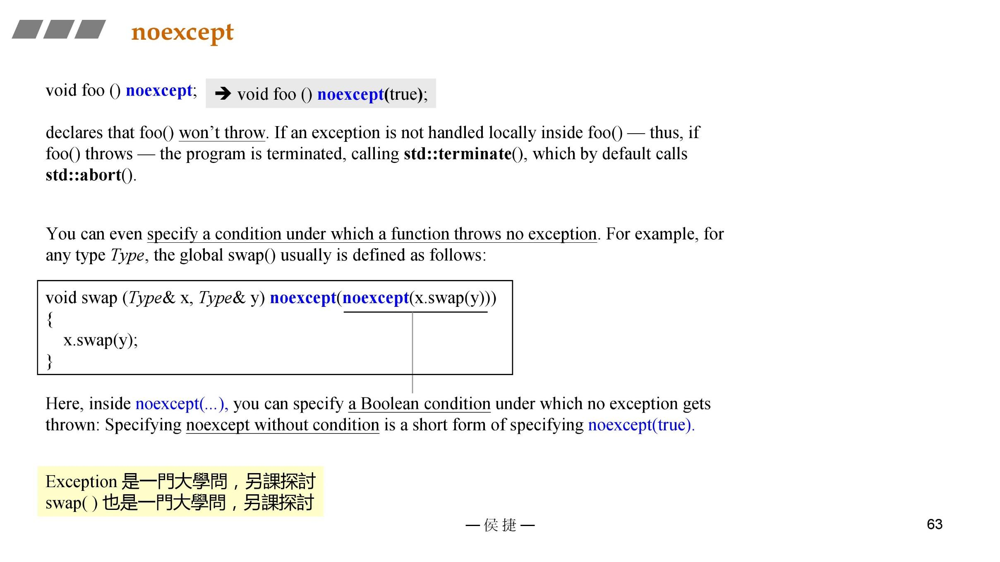

## override

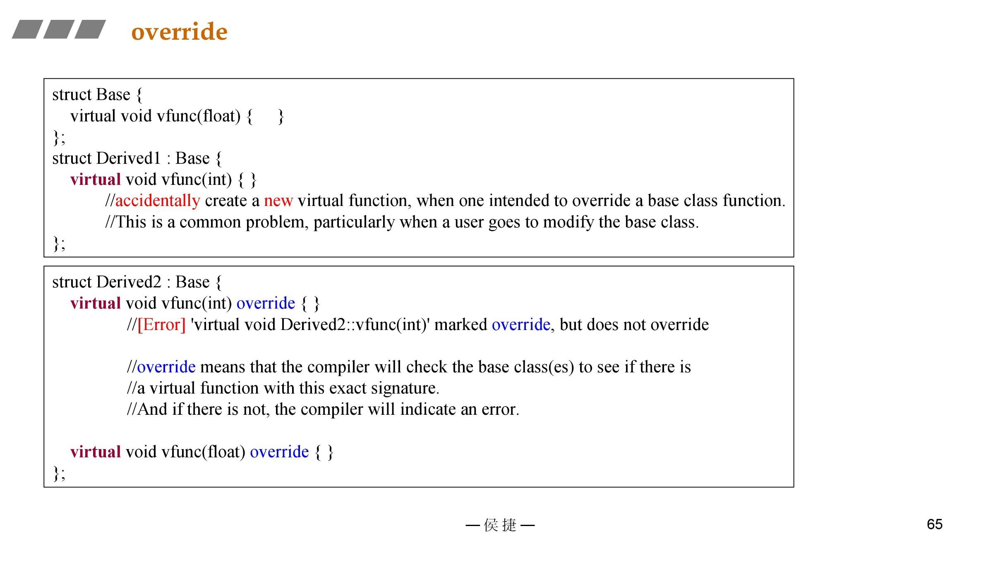

## final

修饰class，表示其不可再被继承

修饰虚函数，表示其不可再被override

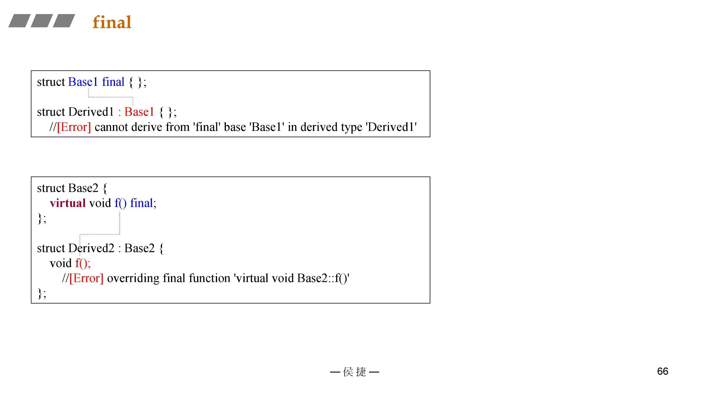

## decltype

用来推导表达式的类型

```C++
template<typename T1, typename T2>
auto add(T1 x, T2 y) -> decltype(x+y)
```

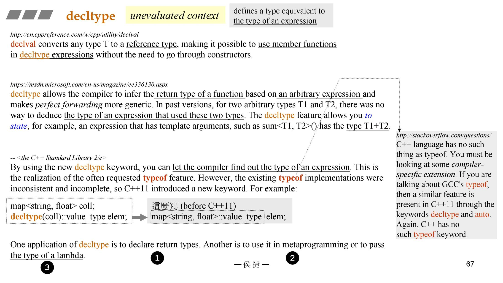

## Lambdas

Lambdas表达式是用类进行实现的

The type of a lambda is an anonymous function object(or functor)

Lambdas have no default constructor and no assignment operator

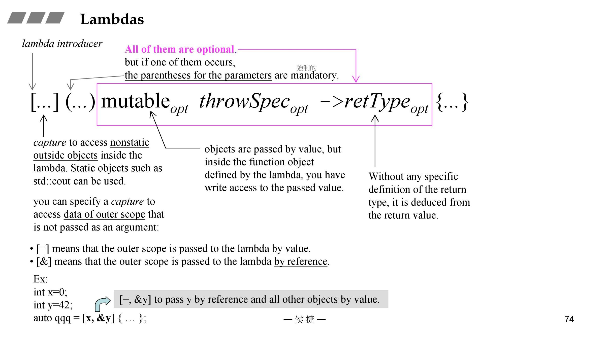
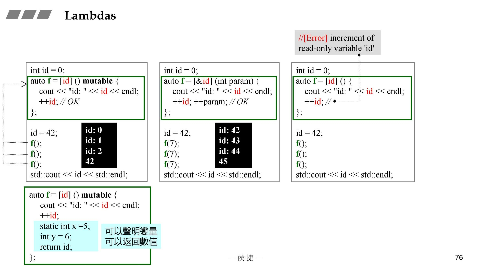
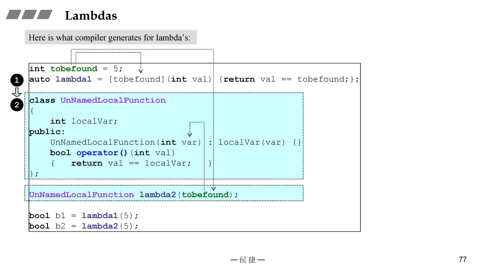

## Variadic Templates

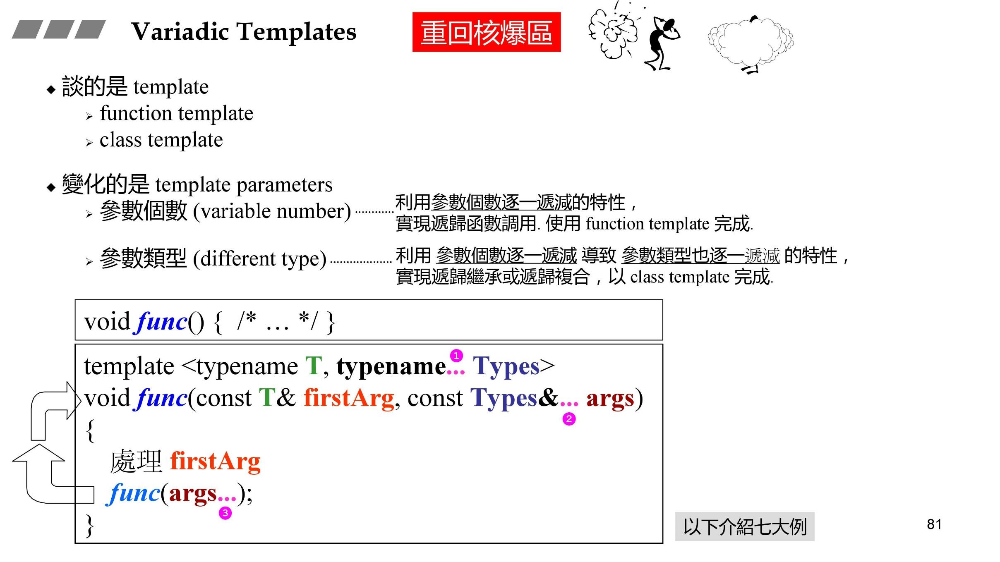

```C++
    int max(int n)
    {
        return n;
    }

    template<typename...Args>
    int max(int n, Args...args)
    {
        return std::max(n, max(args...));
    }

    int main(int argc, char* argv[])
    {
        std::cout << "Version: " << _MSVC_LANG << std::endl;

        std::cout << max(1, 2, 3, 4, 5, 6) << std::endl;

        return 0;
    }
```

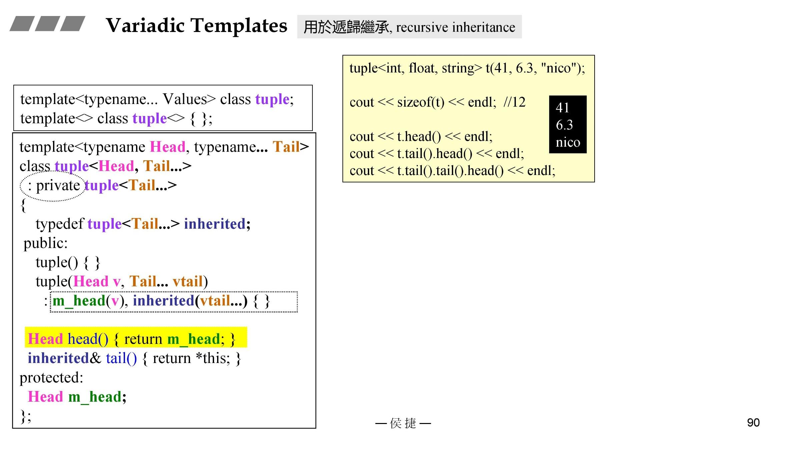
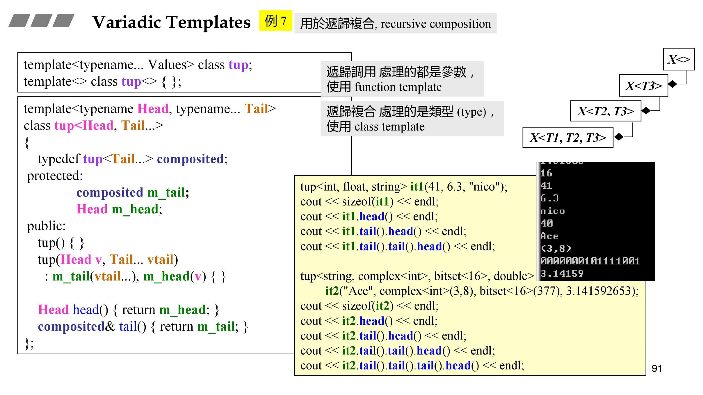