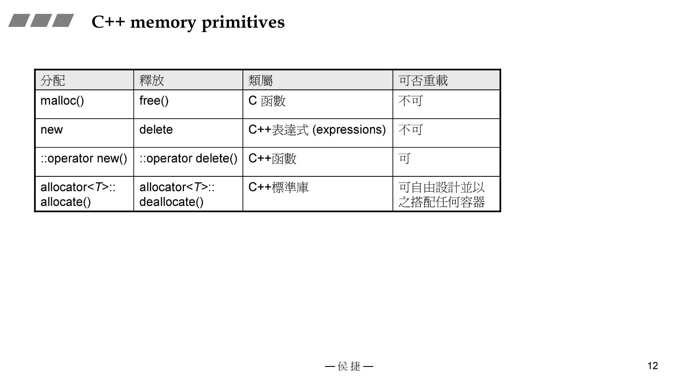
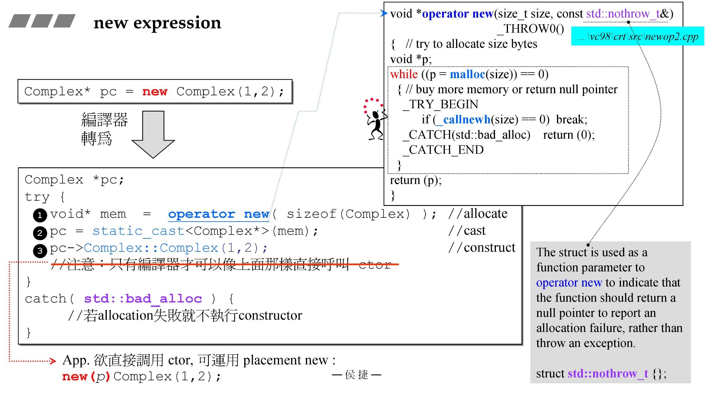
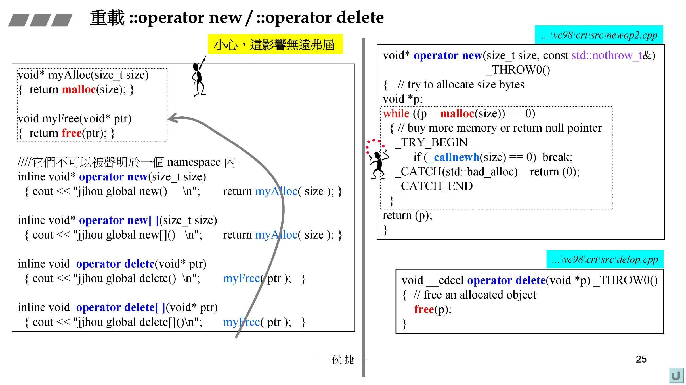

# C++内存管理

## C++ memory primitives

## new expression

## delete expression

## Ctor & Dtor直接调用

## array new, array new

## placement new（定点new）

在指定的位置（内存已经分配好）创建对象

## C++应用程序，分配内存的途径

## 重载new()/delete()

## per-class allocator1

后者间隔之所以为16，是因为每个对象都存在cookies（记录区块大小）

## per-class allocator2

## static allocator

注意此处 embedded pointer

## macro for static allocator

## new handler

## =default, =delete

