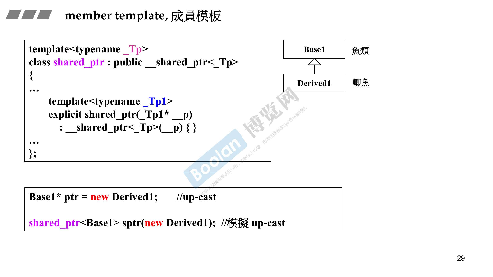
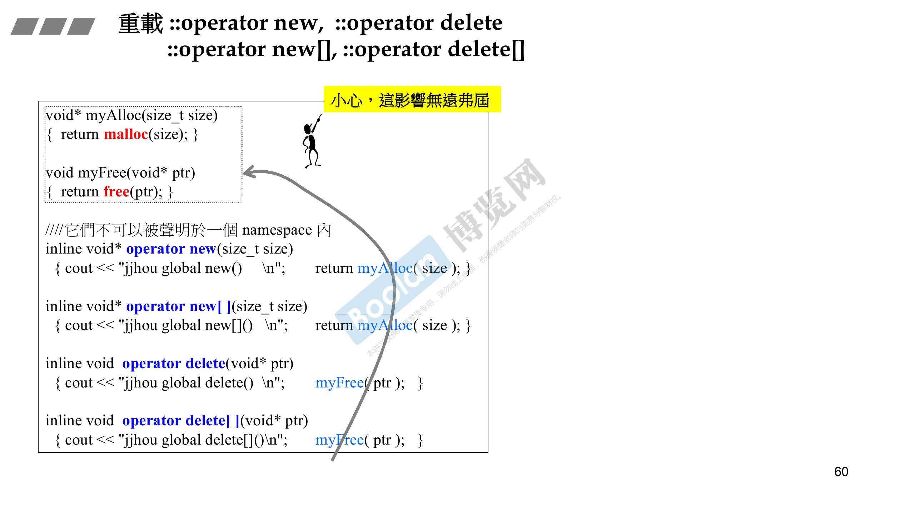
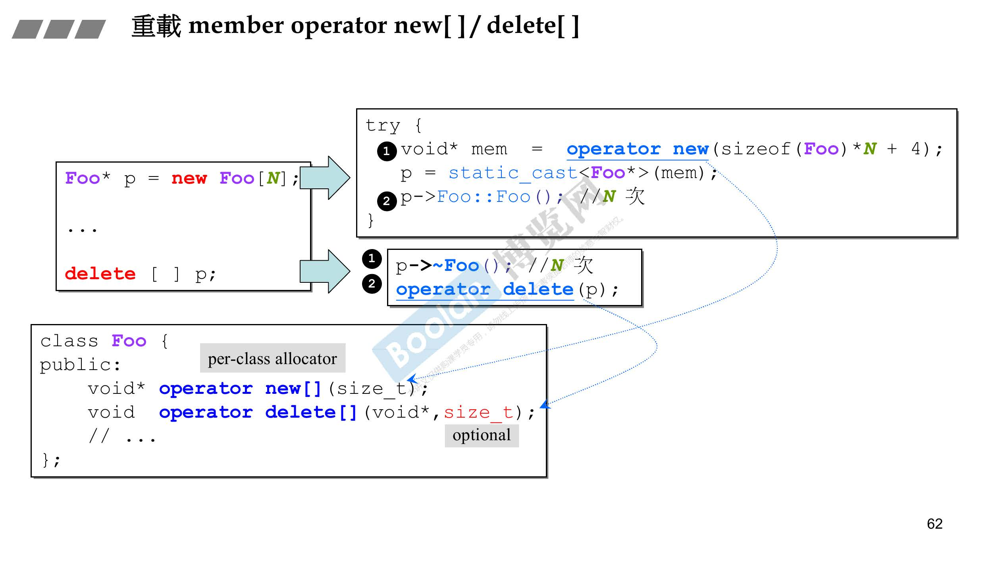

# 兼谈对象模型

## 转换函数

```C++
#include <iostream>

class Fraction
{
public:
	Fraction(int num, int den = 1)
		:m_numerator(num), m_denominator(den) {}

	operator double() const
	{
		std::cout << "Change to double..." << std::endl;
		return (double)m_numerator / m_denominator;
	};

private:
	int m_numerator;
	int m_denominator;
};

int main(int argc, char* argv[])
{
	std::cout << _MSVC_LANG << std::endl;

	Fraction f(3, 5);
	double d = 4 + f;
	std::cout << d << std::endl;

	return 0;
}
```

```C++
#include <iostream>

class Fraction
{
public:
	Fraction(int num, int den = 1)
		:m_numerator(num), m_denominator(den) {}

	Fraction operator+ (const Fraction& f)
	{
		return Fraction(this->m_numerator + this->m_denominator * f.m_numerator,
			this->m_denominator);
	}

private:
	int m_numerator;
	int m_denominator;
};

int main(int argc, char* argv[])
{
	std::cout << _MSVC_LANG << std::endl;

	Fraction f(3, 5);
	Fraction d = f + 4;

	return 0;
}

```


## 智能指针

1. -> 符号具有传递性
2. 返回对象时使用了引用
3. 返回指针时使用了指针


## 仿函数


用来被子类继承以实现萃取功能


## 成员模板

up-cast技术



## 模板特化


## 模板偏特化


## 模板模板参数


## C++标准库


## Reference

reference 可以被修改，修改后地址不变，内容发生变化

```C++
#include <iostream>

int main(int argc, char* argv[])
{
	std::cout << _MSVC_LANG << std::endl;

	int x = 0;

	int* p = &x;
	int& r = x;

	std::cout << x << std::endl;
	std::cout << r << std::endl;
	std::cout << *p << std::endl;
	std::cout << p << std::endl;

	int x2 = 1;
	r = x2;

	std::cout << x << std::endl;
	std::cout << r << std::endl;
	std::cout << *p << std::endl;
	std::cout << p << std::endl;

	return 0;
}
```


两个相同的函数，一个有const，一个无const，两者可以并存


## 构造和析构关系

### 继承关系下

1. 构造由内而外（Base -> Derived）
2. 析构由外而内（Derived -> Base）

### 复合关系下

1. 构造由内而外（Component -> Container）
2. 析构由外而内（Container -> Component）

### 继承+复合关系下

1. 构造由内而外（Base -> Component -> Derived）
2. 析构由外而内（Derived -> Component -> Base）

## 对象模型

```C++
#include <iostream>

class A
{
public:
	virtual void vfunc1() {}
	virtual void vfunc2() {}
	void func1() {}
	void func2() {}

private:
	int m_data1;
	int m_data2;
};

class B :public A
{
public:
	virtual void vfunc1() {}
	void func2() {}
private:
	int m_data3;
};

class C :public B
{
public:
	virtual void vfunc1() {}
	void func2() {}
private:
	int m_data1;
	int m_data4;
};

int main(int argc, char* argv[])
{
	std::cout << _MSVC_LANG << std::endl;
	A a;
	B b;
	C c;

	return 0;
}

```


## this 指针

指向当前对象的指针（指向当前对象的地址）

## const修饰成员函数


## 重载 operator new, operator delete






包含虚函数，则内存增加4/8个字节存放虚指针
operator new[]下，多出的四个字节用来记录调用析构函数的次数

