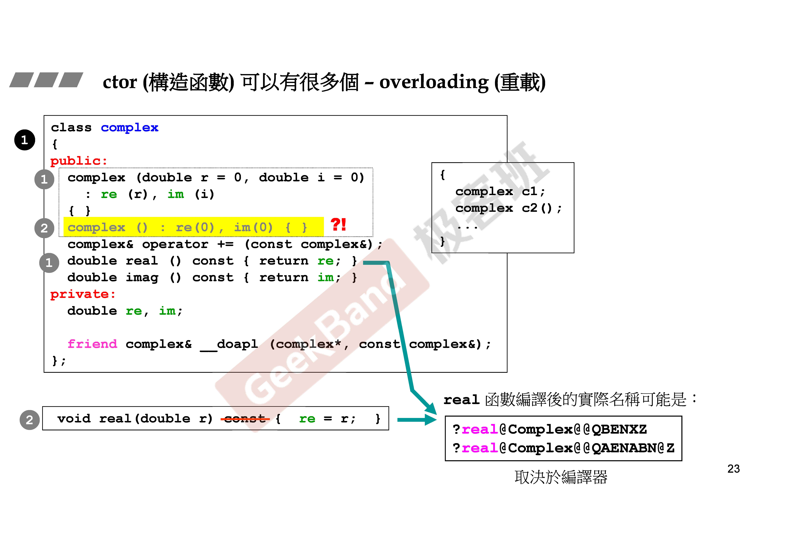
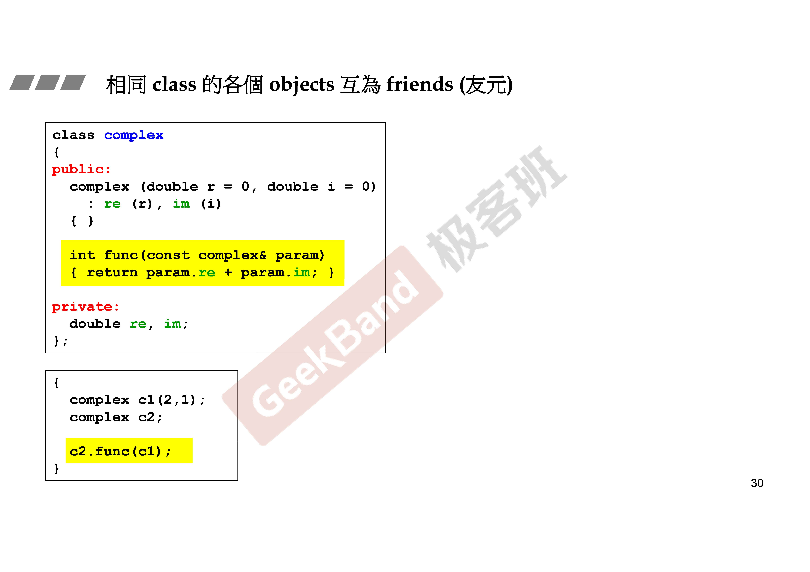
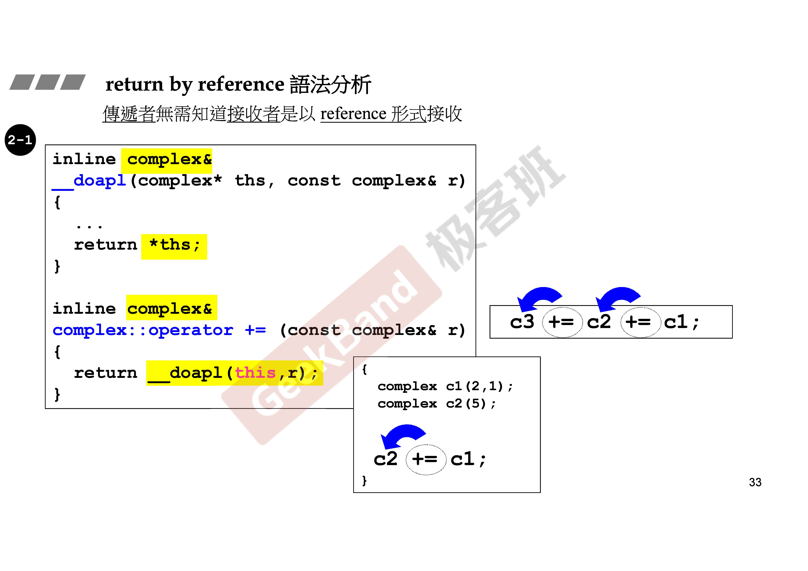
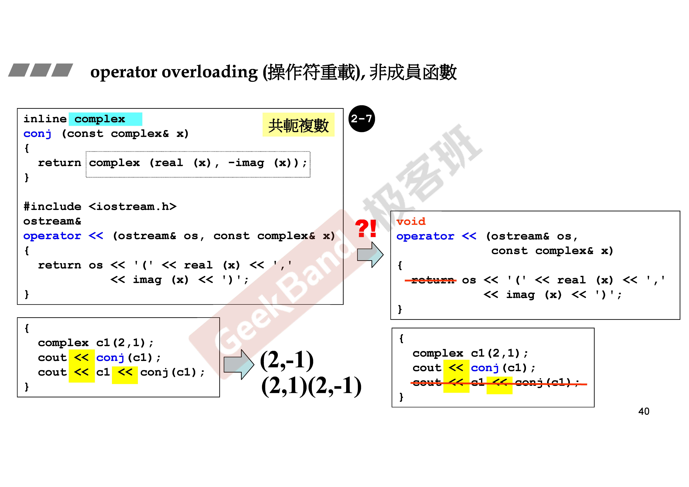
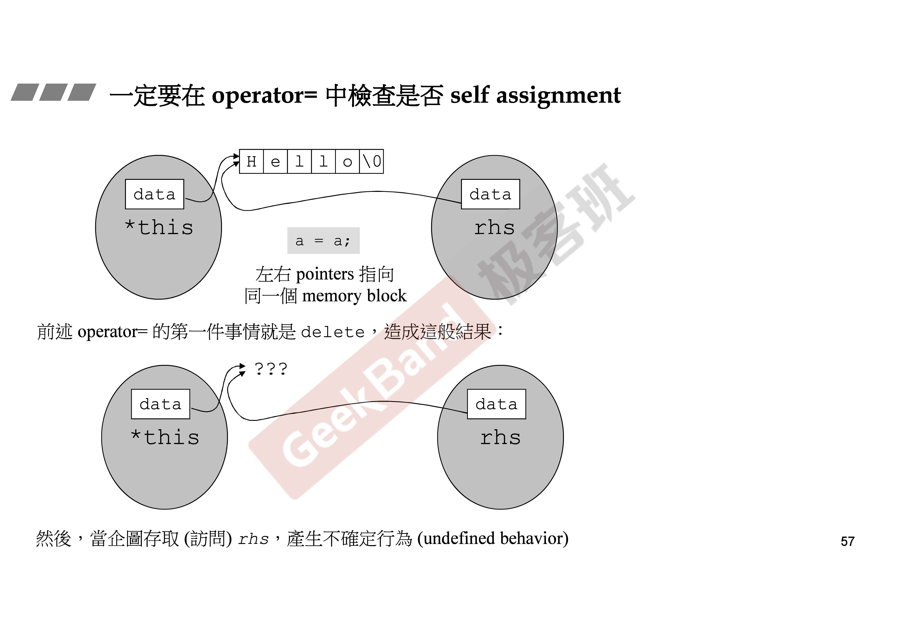
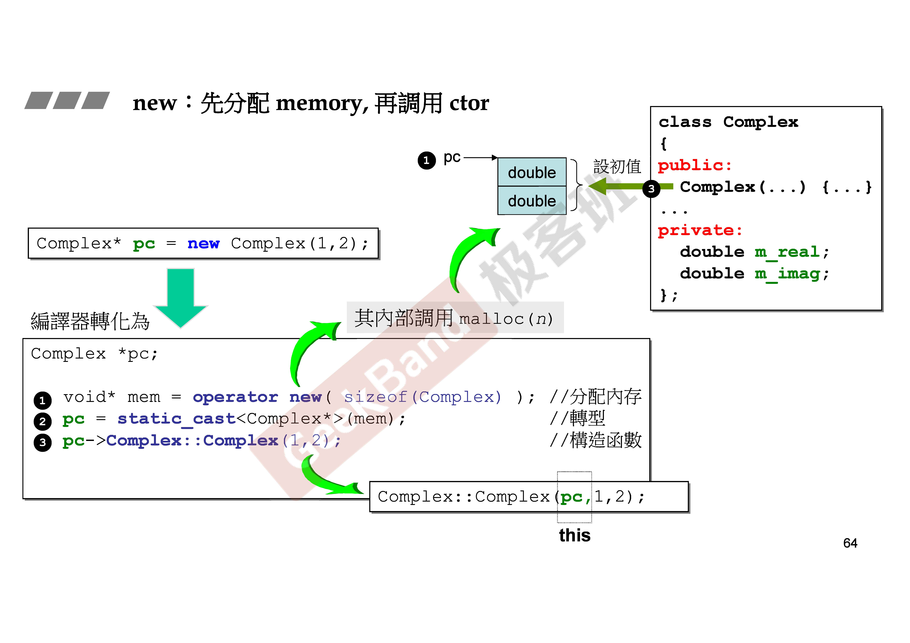
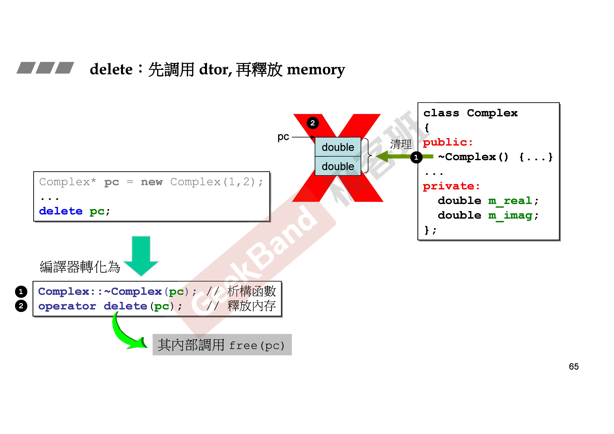
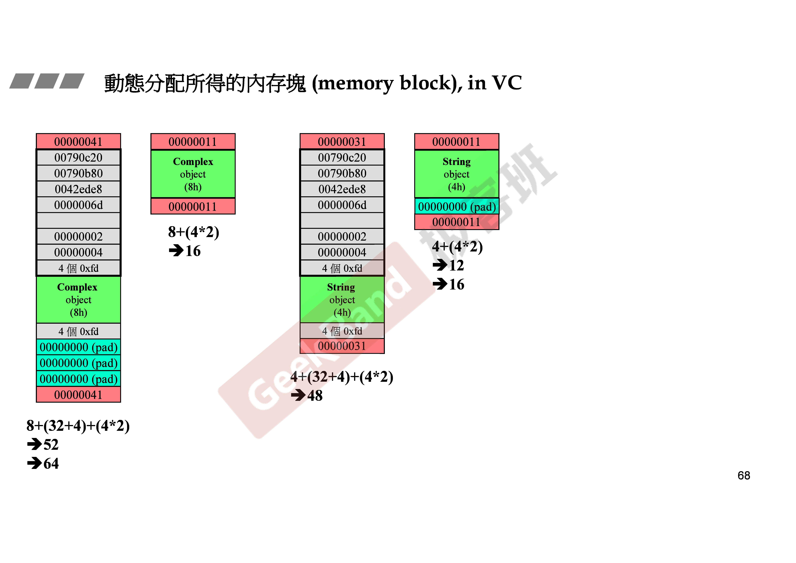
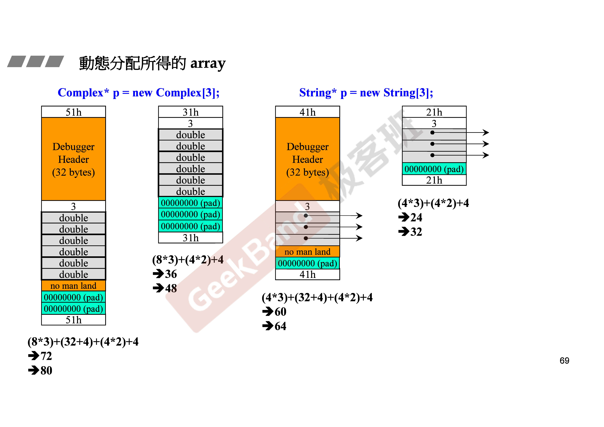
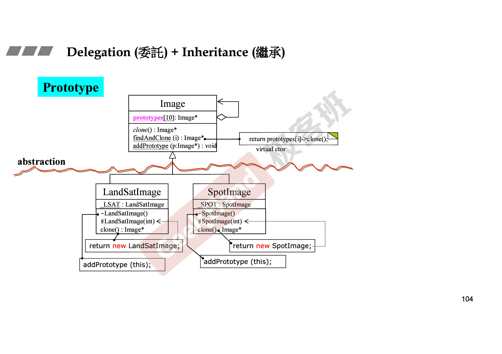

# C++类基础知识

## 构造函数



## inline函数

函数若在class body内定义完成，便自动成为inline候选人

## 相同class的各个objects互为friends（友元）



## pass or return by reference

不要返回临时对象的引用



## operator overloading



## copy assignment operator



## new and delete




## 内存管理




## 调用私有构造函数

总结一下就是为了避免创建对象时调用类的构造函数，而是想将生成对象的方式以其它的方式实现，则可将所有的构造函数声明为非public的，这样并不意味着该类无意义，不能实例化生成对象。

生成对象可以两种方式：

1. 通过同时为该类声明Public的static成员函数，在该static成员函数中调用该类私有的构造函数，生成实例，static成员函数是属于任何一个对象，而是属于类的，故可以在没有该类的对象的情况下，通过<类名>::<static 公有成员函数名>(参数)的方式来实现。

2. 通过该类的友元函数，或该类的友元类的成员函数调用此私有构造函数来实现。



```C++
    #include <iostream>

    class WonderfulClass
    {
    public:
        static WonderfulClass* makeAnObject()
        {
            // 创建一个WonderfulClass对象并返回其指针
            return (new WonderfulClass);
        }
    private:
        WonderfulClass() {}
    };
    int main(int argc, char* argv[])
    {
        std::cout << _MSVC_LANG << std::endl;

        WonderfulClass* p = WonderfulClass::makeAnObject();

        delete p;

        return 0;
    }
```
